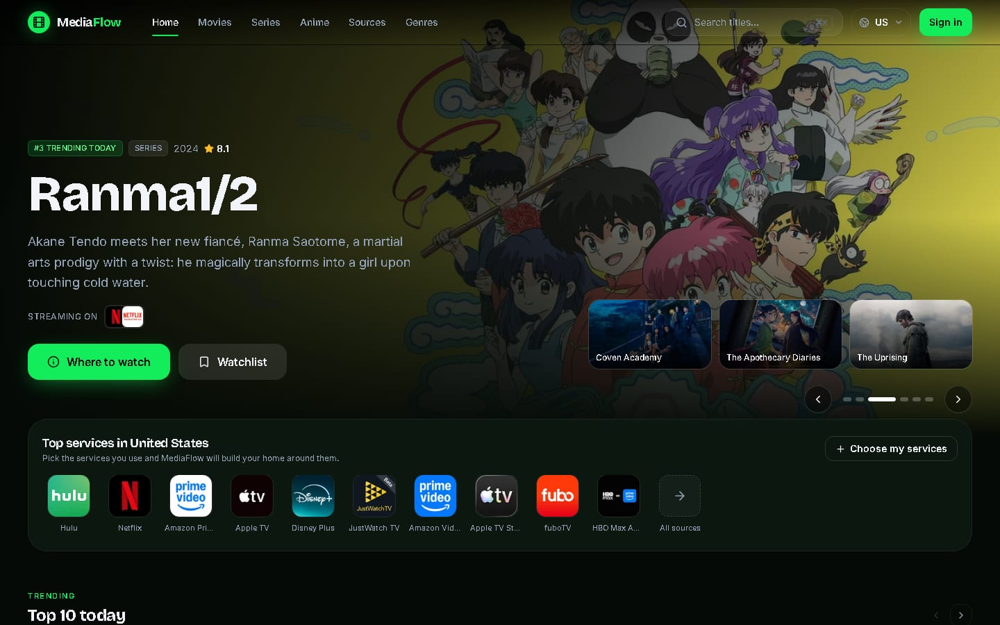
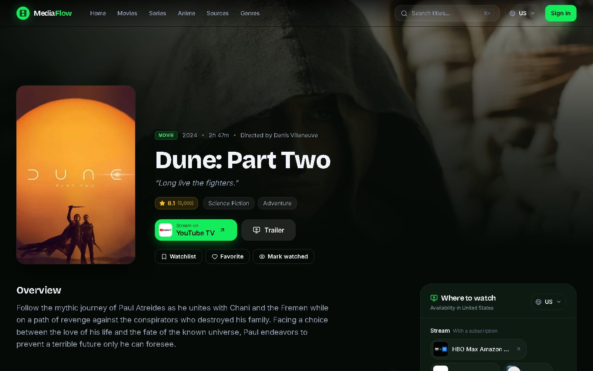
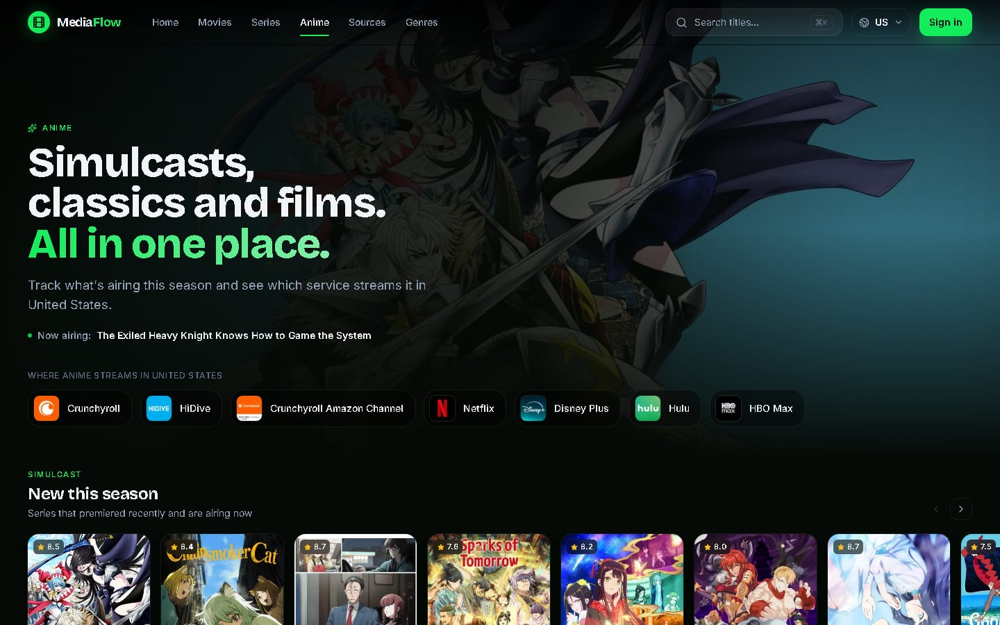
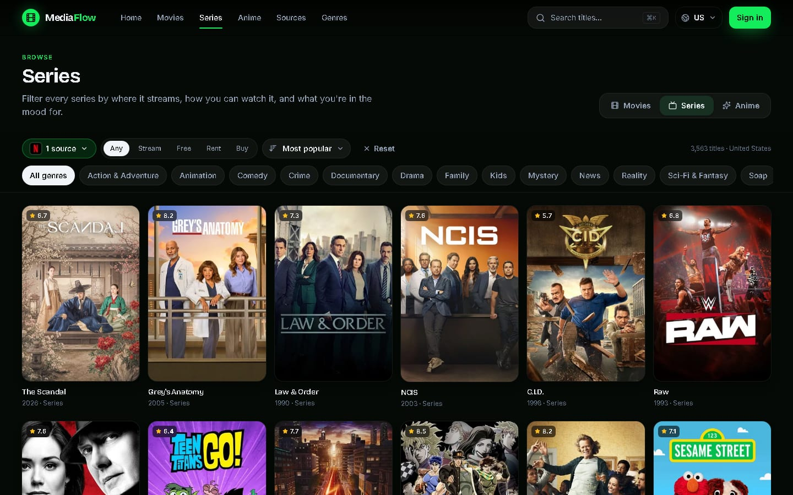
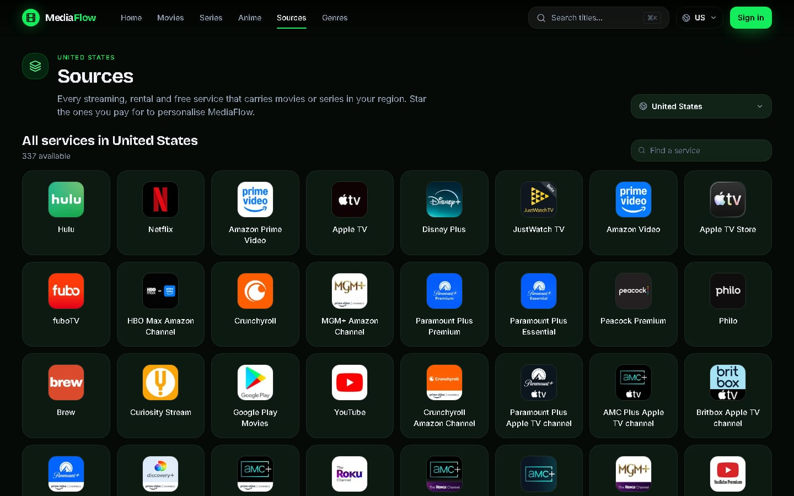
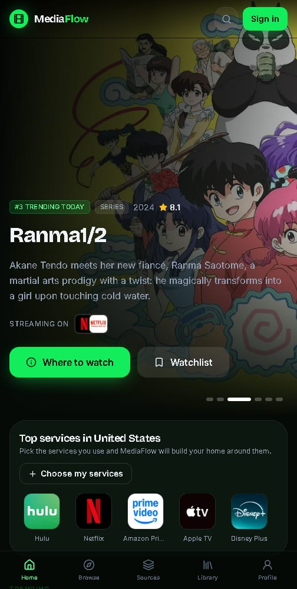

<div align="center">


# MediaFlow

**Every streaming service, one place.**
Find where to stream, rent or buy any movie, series or anime in your region, and keep one watchlist across all of them.

[](https://github.com/lakshgupta8/mediaflow/actions/workflows/ci.yml)




</div>

## Why MediaFlow

Your shows are spread across Netflix, Prime Video, Crunchyroll, Disney+ and a dozen rental stores. MediaFlow answers the one question every service avoids: **where can I actually watch this, here, right now?**

MediaFlow does not host or stream anything. Every "Stream on" button sends you to the official service.

## Features

| | |
| --- | --- |
| **Where to watch, everywhere** | Streaming, free, ad-supported, rental and purchase options for every title, in any region TMDB covers. Switch region from the top bar. |
| **Your services first** | Star the services you pay for. The home page, title pages and filters then put your services ahead of the rest. |
| **Browse by source** | Filter the whole catalogue by service, how you can watch it (stream, free, rent, buy), genre and sort order. Every filter lives in the URL, so any view can be shared. |
| **Anime hub** | Simulcasts airing this season, the most popular series, films, top-rated lists and a filterable anime catalogue. Explicit titles are excluded. |
| **Sources directory** | Every service available in your region, each with its own browsable catalogue. |
| **Rich title pages** | Trailers, cast and crew, season and episode guides, recommendations and community reviews with replies. |
| **One library** | Watchlist, favorites and a watched log that sync across devices. |
| **Fast search** | Press <kbd>⌘</kbd> <kbd>K</kbd>, <kbd>Ctrl</kbd> <kbd>K</kbd> or <kbd>/</kbd> to search movies, series and people from any page. |
| **Accounts** | Email and password sign-in, password reset, profile photo with cropping, and full account deletion. |
| **Built for every screen** | Responsive layout with a bottom tab bar on phones. |

## Screenshots

<table>
  <tr>
    <td width="50%"><p align="center"><sub>Title page with the best source for your region</sub></p></td>
    <td width="50%"><p align="center"><sub>Anime hub with this season's simulcasts</sub></p></td>
  </tr>
  <tr>
    <td width="50%"><p align="center"><sub>Browse filtered by source, availability and genre</sub></p></td>
    <td width="50%"><p align="center"><sub>Every service in your region</sub></p></td>
  </tr>
</table>

<p align="center">
  
</p>

## Tech stack

| Area | Tools |
| --- | --- |
| Framework | [Next.js 16](https://nextjs.org/) (App Router, Turbopack, React Compiler), [React 19](https://react.dev/), [TypeScript](https://www.typescriptlang.org/) |
| Styling | [Tailwind CSS 4](https://tailwindcss.com/), [Framer Motion](https://www.framer.com/motion/), [Lucide](https://lucide.dev/) icons |
| Data | [TanStack Query](https://tanstack.com/query), [Redux Toolkit](https://redux-toolkit.js.org/), [TMDB API](https://developer.themoviedb.org/) with [JustWatch](https://www.justwatch.com/) availability |
| Backend | [Appwrite Cloud](https://appwrite.io/) for auth, database (TablesDB) and file storage |
| Forms | [React Hook Form](https://react-hook-form.com/) and [Zod](https://zod.dev/) |
| Tooling | [Bun](https://bun.sh/), ESLint, GitHub Actions |

## Getting started

### Prerequisites

- [Bun](https://bun.sh/) 1.2 or newer
- A free [TMDB](https://www.themoviedb.org/signup) account for an API read access token
- A free [Appwrite Cloud](https://cloud.appwrite.io/) project

### 1. Install

```bash
git clone https://github.com/lakshgupta8/mediaflow.git
cd mediaflow
bun install
```

### 2. Configure environment variables

```bash
cp .env.example .env.local
```

| Variable | Where to find it | Exposed to the browser |
| --- | --- | --- |
| `NEXT_PUBLIC_TMDB_ACCESS_TOKEN` | TMDB → Settings → API → *API Read Access Token* | Yes |
| `NEXT_PUBLIC_APPWRITE_ENDPOINT` | Appwrite → your project → Settings (may be regional) | Yes |
| `NEXT_PUBLIC_APPWRITE_PROJECT_ID` | Appwrite → your project → Settings | Yes |
| `APPWRITE_API_KEY` | Appwrite → Overview → Integrations → API keys | **No, server only** |

`.env.local` is git-ignored. Never commit it, and never give the API key a `NEXT_PUBLIC_` prefix.

### 3. Set up Appwrite

1. In **Overview → Platforms**, add a **Web** platform for `localhost` (and later your production domain). Appwrite rejects browser requests from unlisted hosts.
2. Create an API key with the scopes listed in [`.env.example`](.env.example).
3. Create the database, tables, indexes and storage bucket:

   ```bash
   bun run setup:appwrite
   ```

   The script is idempotent and skips anything that already exists.

| Appwrite resource | Used for |
| --- | --- |
| Auth (email and password) | Sign-up, sign-in, password recovery emails |
| TablesDB `mediaflow` | `profiles`, `watchlists`, `favorites`, `recent_watches`, `reviews` |
| Storage bucket `avatars` | Profile photos |

Every row carries its own permissions. Lists are readable only by their owner. Profiles and reviews are public to read but editable only by their author.

### 4. Run

```bash
bun dev
```

Open [http://localhost:3000](http://localhost:3000).

## Scripts

| Command | What it does |
| --- | --- |
| `bun dev` | Start the dev server |
| `bun run build` | Production build |
| `bun start` | Serve the production build |
| `bun run lint` | ESLint |
| `bun run typecheck` | TypeScript, no emit |
| `bun run setup:appwrite` | Provision the Appwrite database, tables and bucket |

## Deploying

MediaFlow deploys to [Vercel](https://vercel.com/) or any Node host with no extra configuration.

1. Add the four environment variables from the table above to your host.
2. Add your production domain as a **Web** platform in Appwrite. Password recovery emails link back to `/reset-password` on whichever domain sent them, so this step also makes recovery work.

## Project structure

```text
app/                 Routes: home, browse, anime, sources, genre, movie, series, people, library, auth, settings
  api/               Server routes that use the Appwrite API key (email check, account deletion)
components/
  layout/            Top nav, mobile tab bar, search palette, user menu, logo
  home/ discover/    Hero carousel, services strip, filterable catalogue
  detail/            Title hero, episodes, cast, trailer modal
  providers/         Where-to-watch panel, region picker, service logos and picker
  media/ library/    Cards, rails, grids, watchlist and history views
  ui/                Shared primitives (buttons, chips, skeletons, headers)
hooks/               Data hooks (providers, preferences, user data, library actions)
lib/                 Appwrite clients, config and media helpers
services/            TMDB, auth and user-data services
store/               Redux slices for auth and preferences
scripts/             Appwrite provisioning script
```

## Data and attribution

Movie, series and people data come from [TMDB](https://www.themoviedb.org/). Streaming availability is provided by [JustWatch](https://www.justwatch.com/) through the TMDB API.

This product uses the TMDB API but is not endorsed or certified by TMDB.

## How it was built

MediaFlow started as an experiment in AI-assisted development. The original app was built with **Antigravity (Gemini)**, using the StitchMCP and Context7 MCP servers for early layouts and library docs. The Appwrite migration and the multi-source redesign were done with **Claude Code**.
